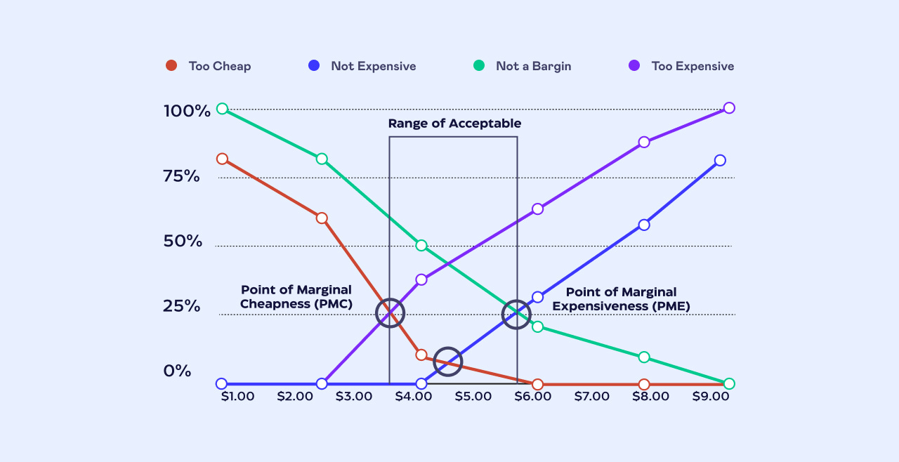

# Project Proposal for Grey Ogre Games
First of all I am going to start with the problems that has happened throughout store's operation. I will focus on MTG section of problems and I will use 3 factors to judge, importance, difficulty to create a solution and time requirement. The solutions can be applied to Pokemon or other card games but that is not our main source of income for now. Tradeoffs using current set of technologies should be laid out and discussed. Timeline of such solution creation will not be specific but it will be a rough estimate based on my current skills. To put in context, an end-to-end software project (a product) requires a team of 3~5 and 6 months. A new working feature for a single project usually requires 1 month with such team.

*10~15 minutes of reading*.

##  1. Pricing Baseline
At the moment we have enough data points from the past 4~5 years of using Binderpos and Shopify to generate a pricing baseline for cards. This project is not specifically targeted towards Binderpos but it will be the baseline of our prices for future. I can still use CK as a main data point but I believe creating our own pricing will be needed sooner or later. 

A solution that I will propose is to use a web crawler using [Spider](https://spider.cloud/) to gather all the relevant data from CK, Hareruya etc. Next, we use the statistical approaches that I am currently learning to produce the pricing baseline tailored to our data points. I will start by using a smaller dataset, then expand from there for all the cards. 
```
4 Steps:
Gather Data -> Clean it -> Process it -> Data out
```



 Importance | Difficulty | Time Required 
 :---: | :---: | :---: 
4/5 | 4/5 | 4 Months

Project extension ideas:
 - Auto-updater to Binderpos/shopify
 - Public facing buylist

## 2. Binder Clone
Currently Binderpos is our main source of sales and source of problem. I believe we should move away from Binderpos sooner or later but, in the meantime Binderpos is not as reliable anymore. Creating a fully functional Binderpos clone may be desirable and although it may look simple but, it is not.

To create a Binder clone I need this knowledge / requirements:
1. Operating Systems -> Distributed Systems in depth knowledge
2. 10000 ~ 100000 lines of code
3. A Software Team
4. Maybe funding?

There reason why Binderpos is getting worse is because maintaining data intensive systems requires a talented software team. Since their acquisition, I believe it is no longer their priority to have a talented software team and maintain the system.

 Importance | Difficulty | Time Required 
 :---: | :---: | :---: 
 5/5 | 6/5 | 12 months+

 Do keep in mind that alternatives will also face the same problem as Binderpos from being reliable to unreliable. It is just the nature of subscription based model to capture and lock in customers. Creating our own may be worth it if we are going to scale 5~10x our current operation, meaning this project is backed by more people and more money. I have seen [SortSwift](https://www.sortswift.com/) in action. They are powerful but they add a lot of complexity for the rest of the non-technical staff. It is not easy to use due to its engineering-centric POV. Another possible alternative is [TCGSync](https://tcgsync.com/). I believe they are easier to use but with less features and a more expensive subscription model.

 ## 3. Public Facing Buylist
I've mentioned previously that this project may be an extension from project 1 however, it may also be a starting point instead and scale to project 1
```
Project 1 -> project 3
VS
Project 3 -> project 1
```

Without the pricing baseline I can think of using [MTGJson](https://mtgjson.com/) as a source of data. Although it is not perfect but it is the best free & open-source database out there. Since the data is already cleaned building a public webpage is the main part of the project. I believe Binderpos already have this function however, since we are considering to move away from binder, creating our own customizable buylist page may be desirable.
```
Advantage:
- streamline buylist process even more
- each buylist submission has an ID attached
- able to reject buylist submission even before we see the cards
- not buying shit cards
```
```
Disadvantage:
- no dark arts
- requires full time system maintenance
```
 Importance | Difficulty | Time Required 
 :---: | :---: | :---: 
 2/5 | 3/5 | 4 Months


## 4. Backstock Value Creation
I believe we can create another MTG store with our current backstock. TODO